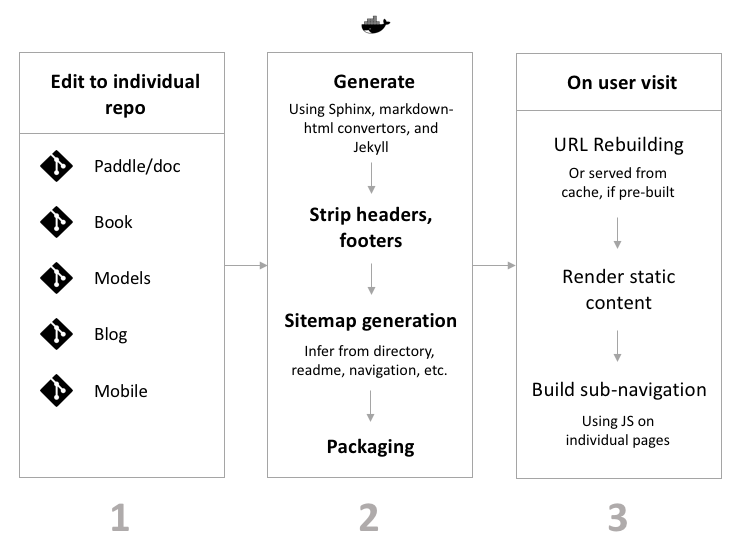
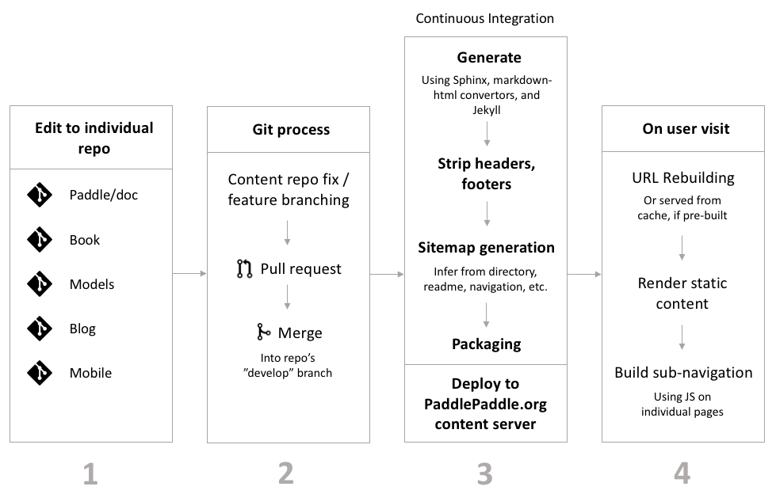

# PaddlePaddle.org Development Guide

Welcome to PaddlePaddle.org (PPO) development guide.  This guide is intended for developers of the PaddlePaddle.org website, and will cover how to setup a development environment for PPO, how to submit code to Github, and finally how to test your changes on the testing environments.

## Technology

This website is built using the Python framework [Django](https://www.djangoproject.com/) (1.8.11) and [Skeleton](http://getskeleton.com/). All the content is served from built assets, and as a result, the website setup does not require any database infrastructure.

The webserver running the site is Gunicorn tied with [Nginx](https://www.nginx.com/). We use a Docker container to deploy it to a public cloud.

## Installation

Please see [Installation Guide](INSTALL.md) to get your environment setup for development.

## Contributing using Git

We invite contributions to both the codebase of PaddlePaddle.org and individual documentation repos. As noted earlier, the documentation content is stored in individual content repos ([book](https://github.com/PaddlePaddle/book), [models](https://github.com/PaddlePaddle/models), etc.) which are fetched and transformed (on Docker during development, and on a continuous integration server in production) before rendering within the PaddlePaddle.org environment. Content updates must be made using the PR process on individual repos. And thus, contributions to this repository should be related to transformation of the raw repository content, styling, and rendering.

A high-level overview of the process of local development looks like this:

### Changes to content

Sometimes, you wish to align content updates with features in PaddlePaddle.org. In such a case, initiate your PR in this repository before your updates to the content - such that PaddlePaddle.org does not break due to major content repo updates.

Note that if you decide to change the structure of the content repos alone, or modify any aspect of them that affects their presentation, navigation, or templating, it might very likely affect the process of generating their PaddlePaddle.org versions. Thus, such changes should always be made with simultaneous updates to PaddlePaddle.org's code.

### Git branching

PaddlePaddle.org utilizes a branching model focusing on two main branches, **develop** and **master**.

- **develop**:  Default branch that contains all the latest development code slated for the next release of the product.
- **master**: The main branch that contains the latest production ready release of the product.

This model also utilizes a few supporting branches:

- **feature**:  Feature branches typically resides within a developer's fork and are branched off of *develop* branch.  These branches are used during development of new features and when completed are merged into origin/develop.  They can be named anything except for master, develop, release-\*, or hotfix-\*
- **release**:  When a PaddlePaddle.org is ready for a new release, a developer would create a release branch off of *develop* branch.  No major code changes should occur on this branch.  However minor bug fixes are allowed.  After the release is ready, this branch is merged into *master* (and tagged), at which point the branch will be removed.   
- **hotfix**:  Used to fix critical production issues.  Typically this branch would be created off of *master* brach, and then merged back into *master* and *develop* once the hotfix is complete

Please visit [A successful git branching model](http://nvie.com/posts/a-successful-git-branching-model/) for more details on this structure.

### Submitting a pull request

For a new feature or bug fix, you are invited to create a new feature branch, and submit it using a Pull Request, where in a repo maintainer will review your changes.

As there is no automated testing process currently, please consider the following before submitting a pull request:
- The preview of content repos you are not working with are not affected by the changes you have made by testing on one repo. There are a lot of edge cases to consider. When in doubt, put up an issue and ask.
- The Docker image builds and the container continues to render content.
- Prior versions don't break. The only good way to test this is to download generated content of old versions into your `.ppo_workspace` and change your version, while watching your cache and session version configuration.
- The pages for language you are not developing with (Chinese or English) do not break. This also requires carefully controlling your cache and session.

## Testing Environments & Deployment

PaddlePaddle.org utilizes Travis-CI to provide for a continuous integration testing environment with every code checking.  PaddlePaddle.org monitors three branches:

- **develop**:  Checkin to this branch will deploy PaddlePaddle.org to the development environment at [http://staging.paddlepaddle.org:82](http://staging.paddlepaddle.org:82)
- **release-&ast;**:  Checkin to this branch will deploy PaddlePaddle.org to the staging environment at [http://staging.paddlepaddle.org](http://staging.paddlepaddle.org)
- **master**:  Checkin to this branch will deploy PaddlePaddle.org to the production environment at [http://www.paddlepaddle.org](http://www.paddlepaddle.org)

Please see [Deployment Guide](DEPLOY.md) for more details.

### Production environment

The production server for PaddlePaddle.org is an AWS-Asia-hosted Ubuntu 16.04 server running the website in a Docker instance, which can be scaled using AWS's load balancer as per need and traffic. Content is deployed into a persistent block storage volume that gets "mounted" to the Docker instance (through the VM), and updated through the a VM mount during continuous integration builds.

### Continuous integration

As stated above, PaddlePaddle.org is continuously deployed through the Travis CI service. See [the config](.travis.yml) for more details.

Apart from continuously integrating the website, this repository also plays a key role in the process of deployment of individual content repos. A high-level overview of this process of deployment looks like this:

The PaddlePaddle.org repository is pulled and invoked through the management command `deploy_documentation` on individual content repos with their custom inputs of source directory, version, and language. Read the `.travis.yml` configurations on each content repo to see when and how this process in involved.

## Extending with new content sources

If you are a part of the core PaddlePaddle team and are tasked with introducing a new content repository to show up as documentation on the website, you may consider the following steps:
- Extending `portal/assets/sitemaps/sitemap_tmpl.json` with a reference to your new repo's sitemap file (which will be generated in a later step).
- Writing a generator (or using an existing Markdown one), stripper, and sitemap generator to build its generated HTML directory from repo contents. The logic for these should is dependent on how content of different languages is organized in the source repo.
- Updating the URL building tooling in `portal/portal/urls.py` and `portal/portal/url_helper.py`.
- Determining how content should be deployed (based on versioning and branching of the source repo), and using that insight to write the Travis CI configuration in the source repo. You may use one of the existing repos as a reference point.
- Extending documentation for people using a Docker-building process locally to clone the new repo to view the built documentation as they edit it.

## Design considerations

Our intention is to keep PaddlePaddle.org's styling and brand consistent with https://ai.baidu.com, when it comes to typography, colors, and visual elements. When in doubt, use that website as a visual reference point.

## Reporting bugs and feature requests

If you do not feel comfortable contributing to the codebase yourself, but have suggestions, feedback, or wish to report bugs, we invite you to do so in the "Issues" section of this repository. Feedback provided on informal channels has a tendency to get lost.

Critical production-related issues may be reported directly to [any of the top contributors](https://github.com/PaddlePaddle/PaddlePaddle.org/graphs/contributors) of this repo.
